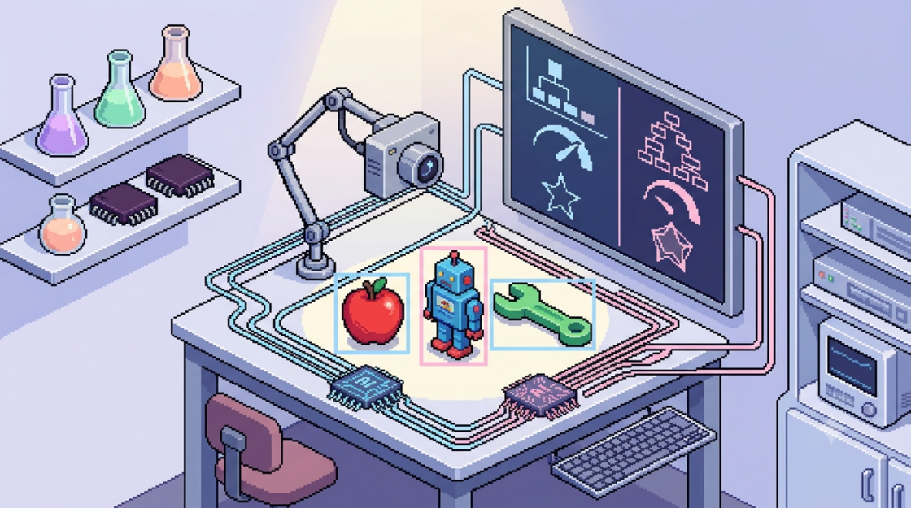
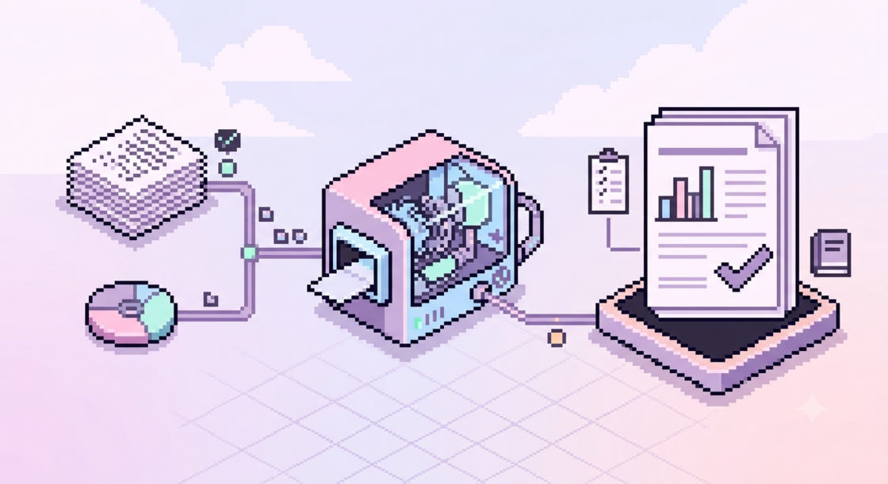

  <h1>AI &amp; Automation Engineer</h1>
  
<strong>Alejandro Padilla</strong> · Ecuador · Remote worldwide

  

  <a href="https://alejandrotatum.github.io/"><strong>Portfolio</strong></a>
  &nbsp;&nbsp;·&nbsp;&nbsp;
  <a href="https://www.linkedin.com/in/alejandro-emanuel-padilla-espinoza-58003b408/"><strong>LinkedIn</strong></a>
  &nbsp;&nbsp;·&nbsp;&nbsp;
  <a href="https://github.com/AlejandroTatum?tab=repositories"><strong>All work</strong></a>

 

  I turn repetitive processes into practical <strong>AI workflows</strong>, <strong>backend systems</strong>, and <strong>full-stack products</strong>.

## Selected Work

<table>
  <tr>
    <td width="50%" valign="top">
       
      <strong>YOLO Complexity Lab</strong> 
      <a href="https://yolo-complexity-lab-unl.streamlit.app/"><strong>Live demo</strong></a> · <a href="https://github.com/AlejandroTatum/yolo-complexity-lab"><strong>Source</strong></a>
    </td>
    <td width="50%" valign="top">
       
      <strong>El Horno del Pingüino</strong> 
      <a href="https://el-horno-del-pinguino-landing-page.onrender.com/"><strong>Live demo</strong></a> · Private business source
    </td>
  </tr>
  <tr>
    <td width="50%" valign="top">
       
      <strong>Academic Report Automation</strong> 
      <a href="https://github.com/AlejandroTatum/academic-report-automation"><strong>Explore source</strong></a>
    </td>
    <td width="50%" valign="top">
       
      <strong>AlejandroTatum.github.io</strong> 
      <a href="https://alejandrotatum.github.io/"><strong>Live site</strong></a> · <a href="https://github.com/AlejandroTatum/AlejandroTatum.github.io"><strong>Source</strong></a>
    </td>
  </tr>
</table>

More evidence: [Hospital Appointment Inventory](https://github.com/AlejandroTatum/hospital-appointment-inventory) · [SIGED](https://github.com/AlejandroTatum/siged), an academic teacher-test project · [all repositories](https://github.com/AlejandroTatum?tab=repositories)

## Toolkit

`Python` · `TypeScript` · `JavaScript` · `Java` · `Next.js` · `React` · `Node.js` · `PostgreSQL` · `Docker` · `Git` · `Linux`

---

  <h3>Have a workflow worth improving?</h3>
  
Open to remote AI &amp; Automation Engineer roles worldwide. Also available for selected freelance automation and software projects.

  <a href="https://www.linkedin.com/in/alejandro-emanuel-padilla-espinoza-58003b408/"><strong>Connect on LinkedIn</strong></a>
  &nbsp;&nbsp;·&nbsp;&nbsp;
  <a href="https://alejandrotatum.github.io/"><strong>View portfolio</strong></a>

