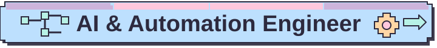
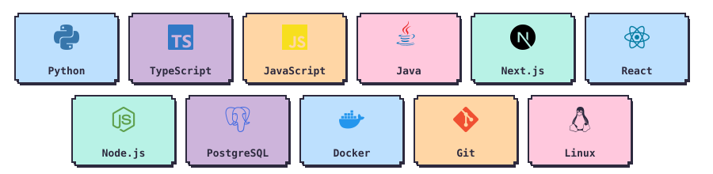

  
  
<strong>Alejandro Padilla</strong> · Ecuador · Remote worldwide

  

  &nbsp;
  &nbsp;
  

 

  I turn repetitive processes into practical <strong>AI workflows</strong>, <strong>backend systems</strong>, and <strong>full-stack products</strong>.

## Selected Work

<table>
  <tr>
    <td width="50%" valign="top">
       
      <strong>YOLO Complexity Lab</strong> 
      &nbsp;
      
    </td>
    <td width="50%" valign="top">
       
      <strong>El Horno del Pingüino</strong> 
      &nbsp;
      
    </td>
  </tr>
  <tr>
    <td width="50%" valign="top">
       
      <strong>Academic Report Automation</strong> 
      
    </td>
    <td width="50%" valign="top">
       
      <strong>AlejandroTatum.github.io</strong> 
      &nbsp;
      
    </td>
  </tr>
</table>

<strong>Private source:</strong> This business source is private; only the live implementation is public.

More evidence: [Hospital Appointment Inventory](https://github.com/AlejandroTatum/hospital-appointment-inventory) · [SIGED](https://github.com/AlejandroTatum/siged), an academic teacher-test project · [all repositories](https://github.com/AlejandroTatum?tab=repositories)

## Toolkit

  

---

  <h3>Have a workflow worth improving?</h3>
  
Open to remote AI &amp; Automation Engineer roles worldwide. Also available for selected freelance automation and software projects.

  &nbsp;
  

