<a href="https://alejandrotatum.github.io/"></a>

&nbsp;
&nbsp;
&nbsp;


## `01` `$ neofetch`



## `02` `$ ls ~/selected-work`

| ▸ [yolo-complexity-lab](https://yololab.streamlit.app/) | ▸ [el-horno-del-pinguino](https://el-horno-del-pinguino-landing-page.pages.dev/) |
|:---:|:---:|
| <a href="https://yololab.streamlit.app/"></a> | <a href="https://el-horno-del-pinguino-landing-page.pages.dev/"></a> |
| **[YOLO Complexity Lab](https://yololab.streamlit.app/)** — end-to-end computer-vision lab to explore YOLO model complexity and deployment tradeoffs. [demo](https://yololab.streamlit.app/) · [source](https://github.com/AlejandroTatum/yolo-complexity-lab) | **[El Horno del Pingüino](https://el-horno-del-pinguino-landing-page.pages.dev/)** — end-to-end frontend for a local bakery: catalog, business orders and WhatsApp conversion. [demo](https://el-horno-del-pinguino-landing-page.pages.dev/) |

▸ **[academic-report-automation](https://github.com/AlejandroTatum/academic-report-automation)** — Python toolkit that automates repetitive report production (HTML/PDF, IEEE-style reference checks) while preserving human review.

▸ **[AlejandroTatum.github.io](https://github.com/AlejandroTatum/AlejandroTatum.github.io)** — bilingual portfolio in two skins (pixel art + this terminal) — the site this README mirrors.

## `03` `$ tree ./stack`

```text
./stack
├── automation-ai/   → Python · AI agents · document generation · validation workflows
├── backend-data/    → Java · PostgreSQL · SQL · Prisma · Maven
├── frontend/        → React · Next.js · Tailwind CSS · responsive UI
└── delivery/        → Git · Docker · Linux · GitHub Actions · testing · docs
```

&nbsp;
&nbsp;
&nbsp;
&nbsp;
&nbsp;
&nbsp;
&nbsp;


## `04` `$ stats --no-cache`




## `05` `$ contact --list`

[](https://alejandrotatum.github.io/)
[](https://www.linkedin.com/in/alejandro-emanuel-padilla-espinoza-58003b408/)
[](https://mail.google.com/mail/?view=cm&fs=1&to=alejandro.padilla@unl.edu.ec&su=Software%20project%20or%20role%20-%20Alejandro%20Padilla)

```text
$ echo "open source, freelance and remote roles — replies in EN/ES"
```

---

`alejandro@github.io:~$` ▊
